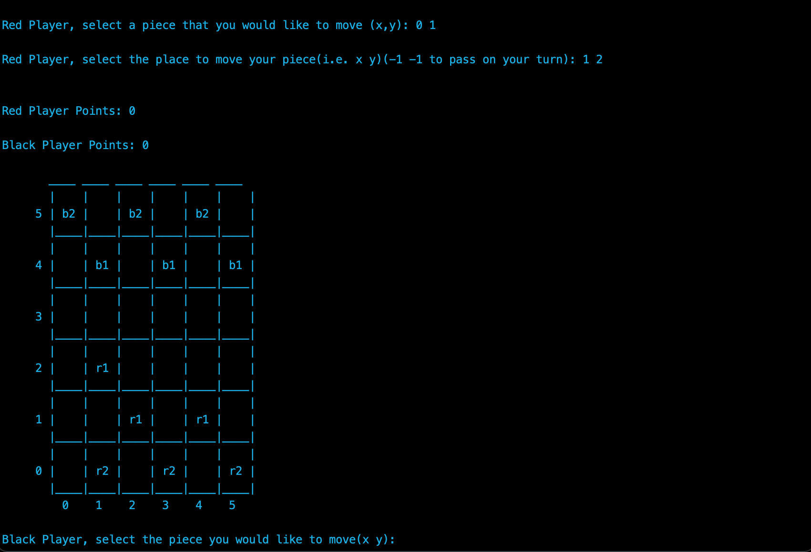

# :sparkles: 6x6 Checkers  :video_game:

### **This project is all in one file (main.cpp).** 


Made with 
 

This is a simple 6x6 game of checkers. Stepwise Refinement was used to create this game.

The game goes as follows:

- First: Ask the red player to select a piece to move. 
- Next, make sure that they have selected a valid piece 
- Then, request the position they would like to move the piece. (while making sure that this new position is valid)
 - In addition, I gave the player the option to pass their turn in case their piece has no valid places to move. 
 - After the Red Player’s turn is over, validate that they do not have the amount of points to win and print the game board. 
 - The black piece player follows the same steps as above, alternating turns until a winner has been found. 


---
## Running the Program
```zsh
$  g++ -o game main.cpp
```
This will create and executable called game.exe 

    You can run the executable by either:

    - using the command below:

        $ ./game

                        or 

    - by opening the executable file itself


---
## Gameplay

*This game follows the same rules as [**checkers**](https://www.itsyourturn.com/t_helptopic2030.html) but with minor differences.*

**The differences between the game are as follows:**

:zap: This new version of checkers is played on a 6x6 board instead of 8x8

:zap: Pieces will be numbered “1” or “2,” only pieces with the same number can jump each
other

:zap:A player cannot jump more than one piece on a given turn

:zap: Players earn points for jumping, first player to 3 wins

:zap:All pieces can move backwards, therefore, “kings” do not exist

:zap:You are not forced to jump a piece given the opportunity


> The start of the game (red piece player always goes first)


> Red piece player moves


> Black piece player moves


> Black piece player gains a point after successfully jumping over the red piece player


